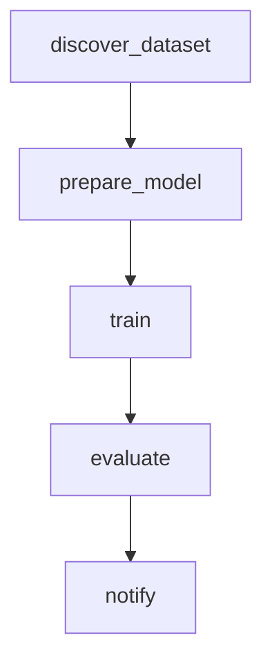

# Visual Workflow Engine (n8n-style)

## Overview

The Flow Engine provides n8n-inspired visual pipeline orchestration. Define training workflows as DAGs (directed acyclic graphs) where each node is a pipeline step and edges define execution order.

## Key Concepts

- **Flow** — a complete workflow definition (JSON/YAML file)
- **Node** — a single step in the flow (dataset discovery, training, evaluation, etc.)
- **Connection** — edges that route data from one node's output to another's input
- **Trigger** — event that starts execution (manual, schedule, webhook)
- **Context** — runtime data store; outputs from each node are available to downstream nodes

## Flow Definition Format

```yaml
name: Math Model Training Pipeline
description: End-to-end math LLM fine-tuning
version: "1.0"
triggers:
  - type: manual
  - type: schedule
    cron: "0 */12 * * *"
nodes:
  - id: node_1
    type: discover_dataset
    params:
      query: "math reasoning"
      max_results: 5
    connections:
      output: node_2
  - id: node_2
    type: prepare_model
    params:
      model_name: "unsloth/mistral-7b-bnb-4bit"
    connections:
      output: node_3
  - id: node_3
    type: train
    params:
      learning_rate: 2e-4
      lora_r: 16
      num_train_epochs: 3
    connections:
      output: node_4
  - id: node_4
    type: evaluate
    params:
      benchmarks: ["mmlu", "gsm8k"]
    connections:
      output: node_5
  - id: node_5
    type: notify
    params:
      channels: ["slack", "email"]
      title: "Training Complete"
```

## Registered Node Types

| Node Type        | Description                    | Parameters                              |
|------------------|--------------------------------|-----------------------------------------|
| `discover_dataset` | Search HuggingFace datasets  | `query`, `max_results`                 |
| `prepare_model`    | Load model + tokenizer       | `model_name`, `quantization`           |
| `train`            | Fine-tune with LoRA          | `learning_rate`, `lora_r`, `epochs`    |
| `evaluate`         | Run benchmarks               | `benchmarks`, `batch_size`             |
| `notify`           | Send notification            | `channels`, `title`, `message`         |
| `merge_models`     | Merge adapters               | `adapter_paths`, `merge_method`         |
| `generate_data`    | Synthetic data generation    | `num_samples`, `domain`                |
| `quantize`         | Quantize model               | `bits`, `method`                       |
| `track_cost`       | Log GPU cost                 | `hours`, `gpu_type`                    |
| `optimize_hp`      | Hyperparameter search        | `domain`, `n_trials`                   |
| `chat`             | Test model generation        | `message`, `max_tokens`                |
| `serve_model`      | Deploy API endpoint          | `port`, `backend`                      |

## Python API

```python
from openclaw_colab_agent.tools.flow import FlowEngine, register_node_type

engine = FlowEngine()

# Create flow
flow_id = engine.create_flow("My Pipeline", "End-to-end training")

# Add nodes
engine.add_node(flow_id, "discover_dataset", {"query": "code"})
engine.add_node(flow_id, "prepare_model", {
    "model_name": "unsloth/mistral-7b-bnb-4bit"
}, after_node="node_1")
engine.add_node(flow_id, "train", {
    "learning_rate": 2e-4, "lora_r": 16
}, after_node="node_2")

# Execute
result = engine.execute(flow_id, tool_executor=my_executor)

# Visualize as Mermaid
print(engine.export_mermaid(flow_id))
```

## API Endpoints

```
POST /flows                   — create flow
GET  /flows                   — list all flows
GET  /flows/{id}              — get flow definition
POST /flows/{id}/nodes        — add node
POST /flows/{id}/execute      — run flow
GET  /flows/{id}/mermaid      — export as Mermaid diagram
```

## Example Mermaid Output



## Comparison to n8n

| Feature              | n8n           | OpenClaw Flow Engine       |
|----------------------|---------------|----------------------------|
| Visual editor        | Yes (UI)      | Mermaid export + API       |
| Node types           | 400+          | 12 (LLM-specific)          |
| Execution            | Server        | CLI / API / Colab          |
| Triggers             | Webhook, cron | Manual, schedule, webhook  |
| Error handling       | Retry, catch  | Retry with backoff         |
| State persistence    | Database      | JSON files + MemoryStore   |
| GPU-aware            | No            | Yes (auto VRAM detection)  |
